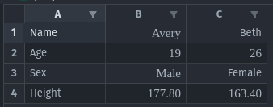
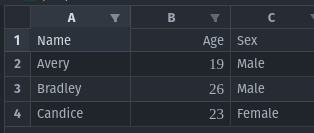
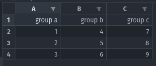

# Excel

## ReadExcel

```go
func ReadExcel(pathToFile, sheetName string, axis int) (DataFrame, error)
```

ReadExcel reads an excel file and converts it to a DataFrame object.

The axis depends on the layout of the data. Row-based data where each group represents a row will have an `axis`=0. Column-based data where each group represents a column will have an `axis`=1.

### Example 1: `axis` = 0


```go
myDf, err := gambas.ReadExcel(filepath.Join(".", "people.xlsx"), "Sheet1", 0)
if err != nil {
    fmt.Println(err)
}

myDf.Print()
```
```
     |    Name     Age    Sex       Height    
0    |    Avery    19     Male      177.8     
1    |    Beth     26     Female    163.4
```

### Example 2: `axis` = 1


```go
myDf, err := gambas.ReadExcel(filepath.Join(".", "people.xlsx"), "Sheet1", 1)
if err != nil {
    fmt.Println(err)
}

myDf.Print()
```
```
     |    Name       Age    Sex       
0    |    Avery      19     Male      
1    |    Bradley    26     Male      
2    |    Candice    23     Female
```

## WriteExcel

```go
func WriteExcel(df DataFrame, pathToFile string) (os.FileInfo, error)
```

`WriteExcel` writes a DataFrame object into an Excel file.

```go
myData := [][]interface{}{{1, 2, 3}, {4, 5, 6}, {7, 8, 9}}
myCols := []string{"group a", "group b", "group c"}
myIndexCols := []string{"group a"}

myDf, err := gambas.NewDataFrame(myData, myCols, myIndexCols)
if err != nil {
    fmt.Println(err)
}

gambas.WriteExcel(myDf, filepath.Join(".", "output.xlsx"))
```
