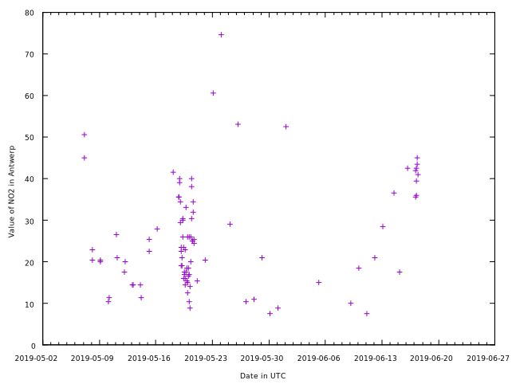

# Plotting

The data used in the example `air_quality_no2.csv` shows the level of NO2 in Antwep, Paris, and London recorded over a certain time peried, sourced from [pandas-dev Github repository](https://github.com/pandas-dev/pandas/blob/main/doc/data/air_quality_no2.csv).

## Plot

```go
func Plot(pd PlotData, setOpts ...GnuplotOpt) error
```

`Plot` plots a set of data given by the `PlotData` object `pd`.

Pass in any `set` options you need. Refer to the [gnuplot documentation](http://gnuplot.info/docs_5.5/loc9418.html) for `set` options.

```go
df, err := gambas.ReadCsv(filepath.Join(".", "air_quality_no2.csv"), []string{"datetime"})
if err != nil {
    fmt.Println(err)
}

filtered, err := df.LocCols("datetime", "station_antwerp")
if err != nil {
    fmt.Println(err)
}

err = filtered.SortByIndex(true)
if err != nil {
    fmt.Println(err)
}

pd := gambas.PlotData{
    Df:       &filtered,
    Columns:  []string{"datetime", "station_antwerp"},
    Function: "",
    Opts:     []gambas.GnuplotOpt{gambas.Using("1:2"), gambas.With("points")},
}

err = gambas.Plot(
    pd,
    gambas.Setterminal("qt"),
    gambas.Setxdata("time"),
    gambas.Settimefmt("%Y-%m-%d %H:%M:%S"),
    gambas.Setformat(`x "%Y-%m-%d"`),
    gambas.Setdatafile(`sep ","`),
    gambas.Setxlabel(`"Date in UTC"`),
    gambas.Setylabel(`"Value of NO2 in Antwerp"`),
)
if err != nil {
    fmt.Println(err)
}
```


## PlotN

```go
func PlotN(plotdata []PlotData, setOpts ...GnuplotOpt) error
```

`PlotN` plots several `PlotData` objects `pd` in one graph.

Use `PlotN` when you want to compare two different datasets, or a dataset with a line of best fit. Refer to the [gnuplot documentation](http://gnuplot.info/docs_5.5/loc9418.html) for `set` options.

```go
df, err := gambas.ReadCsv(filepath.Join(".", "air_quality_no2.csv"), []string{"datetime"})
if err != nil {
    fmt.Println(err)
}

err = df.SortByIndex(true)
if err != nil {
    fmt.Println(err)
}

pd1 := gambas.PlotData{
    Df:       &df,
    Columns:  []string{"datetime", "station_antwerp"},
    Function: "",
    Opts:     []gambas.GnuplotOpt{gambas.Using("1:2"), gambas.With(`lines lc 6 title "Antwerpen"`)},
}
pd2 := gambas.PlotData{
    Df:       &df,
    Columns:  []string{"datetime", "station_paris"},
    Function: "",
    Opts:     []gambas.GnuplotOpt{gambas.Using("1:2"), gambas.With(`lines lc 7 title "Paris"`)},
}
pd3 := gambas.PlotData{
    Df:       &df,
    Columns:  []string{"datetime", "station_london"},
    Function: "",
    Opts:     []gambas.GnuplotOpt{gambas.Using("1:2"), gambas.With(`lines lc 8 title "London"`)},
}

err = gambas.PlotN(
    []gambas.PlotData{pd1, pd2, pd3},
    gambas.Setterminal("qt"),
    gambas.Setxdata("time"),
    gambas.Settimefmt("%Y-%m-%d %H:%M:%S"),
    gambas.Setformat(`x "%Y-%m-%d"`),
    gambas.Setdatafile(`sep ","`),
    gambas.Setxlabel(`"Date in UTC"`),
    gambas.Setylabel(`"Value of NO2"`),
    gambas.Setkey("box width 1 height 1"),
)
if err != nil {
    fmt.Println(err)
}
```
